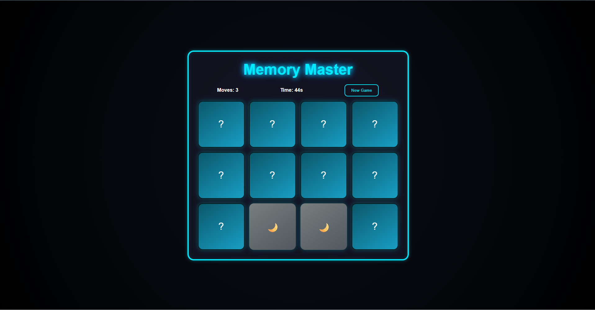
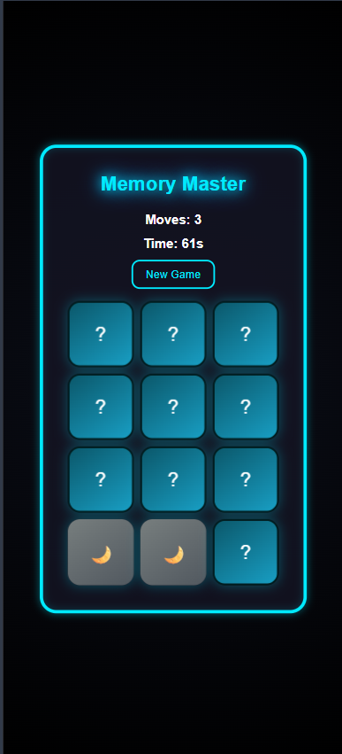

# Memory Card Flip Game

A simple **Memory Card Flip Game** built with HTML, CSS, and JavaScript. Test your memory skills by matching pairs of cards in as few moves as possible!  

---

## 🎮 Features

- Flip cards to reveal hidden images or symbols  
- Match pairs to clear them from the board  
- Count moves and track your score  
- Simple and responsive design  

---

## 🛠️ Technologies Used

- HTML  
- CSS  
- JavaScript  

---

## 🚀 How to Play

1. Open the `index.html` file in your web browser.  
2. Click on a card to flip it.  
3. Try to find its matching pair.  
4. When all pairs are matched, the game is completed!  

---

## 📸 Screenshots

  
  
  

---
