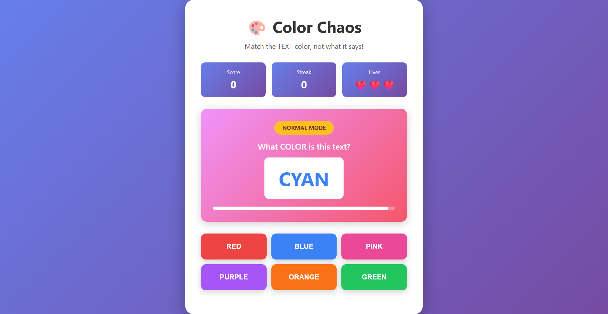

# 🎨 Color Chaos

A fast-paced brain-training game that tests your ability to identify colors under pressure. Match the **text color**, not what the word says!

## 🎮 Game Features

- **Two Game Modes:**
  - **Normal Mode**: Match the color of the text displayed
  - **Chaos Mode**: Unlocks at 100+ points with mismatched color names for extra difficulty
  
- **Progressive Difficulty**: Timer speeds up as your score increases
- **Streak System**: Build combos for bonus points (1.5x multiplier at 5+ streak)
- **Lives System**: 3 hearts to survive - lose them all and it's game over
- **Real-time Stats**: Track your score, streak, correct/wrong answers, and best streak

## 🕹️ How to Play

1. A color name appears on screen in a specific color
2. Click the button that matches the **TEXT COLOR** (not the word itself)
3. Answer quickly before the timer runs out
4. Build streaks for higher scores
5. Survive as long as possible with your 3 lives

## 🎯 Scoring

- Normal Mode: 10 points per correct answer
- Chaos Mode: 20 points per correct answer
- 5+ Streak Bonus: 1.5x point multiplier

## 🚀 Getting Started

Simply open `index.html` in your browser and start playing!

## 🛠️ Technologies Used

- HTML5
- CSS3 (with gradient backgrounds and animations)
- Vanilla JavaScript

---

Test your color perception and reaction time - how high can you score? 🏆
# 🎨 Color Chaos

<h2>🖼️ Preview</h2>

A fast-paced brain-training game that tests your ability to identify colors under pressure.