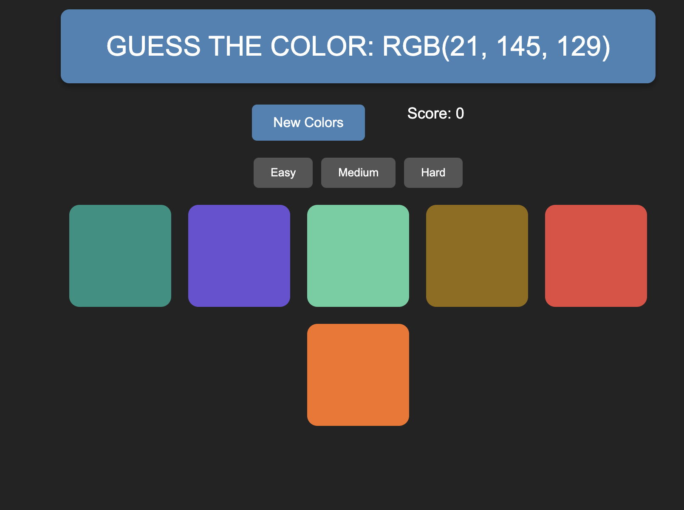

# Guess the Color Game

A fun and interactive game where players guess a color based on its **RGB value**. The game includes multiple difficulty levels, score tracking, responsive design, and hover hints.

## Features

- **Multiple Difficulty Levels**: Easy (3 squares), Medium (6 squares), Hard (9 squares)
- **Score Tracking**: Keep track of your correct guesses
- **RGB Hints**: Hover over squares to see their RGB values
- **Responsive UI**: Works beautifully on desktop, tablet, and mobile
- **Play Again / Reset Button**: Quickly start a new round

## How to Play

1. Look at the **RGB value** displayed at the top.
2. Click the square that matches the color.
3. If correct, all squares change to that color and your score increases.
4. Use the difficulty buttons to change the number of color options.

## Screenshots

### Desktop View



## Installation

1. Clone the repository:
   ```bash
   git clone https://github.com/yourusername/guess-the-color-game.git
