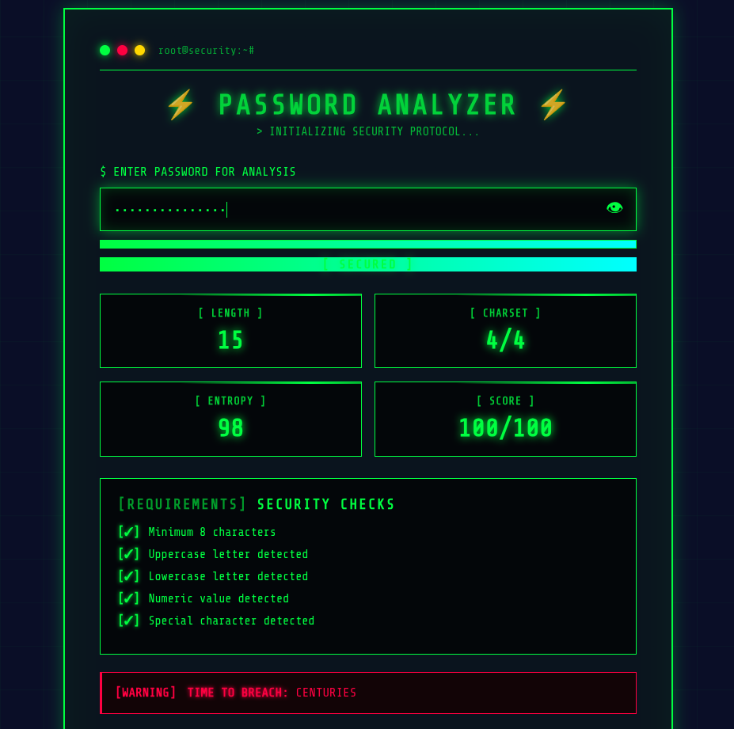

# 🔐 Password Security Analyzer

A interactive web application that analyzes password strength in real-time with a hacker-style interface. Built with vanilla HTML, CSS, and JavaScript.



## ✨ Features

- **Real-time Password Analysis** - Instant feedback as you type
- **Strength Meter** - Visual indicator with 4 security levels (Critical, Warning, Acceptable, Secured)
- **Security Requirements Checker** - Validates 5 essential password criteria
- **Statistics Dashboard** - Displays length, character types, entropy bits, and security score
- **Crack Time Estimator** - Calculates estimated time for brute-force attacks
- **Hacker-Themed UI** - Matrix-style animations with neon green aesthetics
- **Security Tips** - Best practices for password management
- **Show/Hide Password Toggle** - View your password while typing

## 🎨 Design Highlights

- **Matrix Rain Effect** - Animated grid background
- **Glitch Animations** - Periodic border effects
- **Neon Glow** - Green neon highlights on all interactive elements
- **Terminal-Style Interface** - Monospace fonts and command-line aesthetics
- **Scanline Effects** - Retro CRT monitor simulation
- **Cyberpunk Color Scheme** - Green (#00ff41), Black (#0a0e27), Red (#ff0041)

## 🚀 Demo

Simply open `index.html` in your browser to see the analyzer in action!

## 📋 Security Checks

The analyzer validates the following password requirements:

1. ✓ Minimum 8 characters
2. ✓ Contains uppercase letter
3. ✓ Contains lowercase letter
4. ✓ Contains numeric digit
5. ✓ Contains special character

## 🔬 How It Works

### Entropy Calculation
The tool calculates password entropy using the formula:
```
Entropy = Password Length × log2(Character Set Size)
```

### Character Set Sizes:
- Lowercase letters: 26
- Uppercase letters: 26
- Numbers: 10
- Special characters: 32

### Strength Scoring:
- **0-39 points**: Critical (Weak)
- **40-59 points**: Warning (Fair)
- **60-79 points**: Acceptable (Good)
- **80-100 points**: Secured (Strong)

### Crack Time Estimation:
Assumes 1 billion guesses per second (modern GPU capabilities) and calculates the time needed to crack 50% of possible combinations.

## 💻 Technologies Used

- **HTML5** - Structure and semantics
- **CSS3** - Styling with advanced animations
- **JavaScript (ES6)** - Password analysis logic
- **Google Fonts** - Share Tech Mono & Courier Prime

## 🎯 Use Cases

- **Educational Tool** - Learn about password security
- **Password Testing** - Check your passwords before using them
- **Security Awareness** - Understand what makes a strong password
- **Web Development Practice** - Study modern CSS animations and JavaScript

## 🛡️ Security Best Practices

The analyzer promotes these security guidelines:

- Use minimum 12-character passwords
- Mix uppercase, lowercase, numbers, and symbols
- Avoid common words, names, or dates
- Never reuse passwords across different sites
- Enable two-factor authentication (2FA)
- Use a password manager for storage
- Rotate passwords every 3-6 months
- Monitor for unauthorized access attempts

## 📱 Responsive Design

The application is fully responsive and works on:
- Desktop computers
- Laptops
- Tablets
- Mobile devices

## 🎨 Customization

You can easily customize the theme by modifying `style.css`:

```css
/* Change primary color from green to blue */
#00ff41 → #00d4ff

/* Change background color */
#0a0e27 → your-color

/* Adjust animation speed */
animation: matrix 20s → 10s
```

## 📝 License

This project is licensed under the MIT License - see the LICENSE file for details.

## 🙏 Acknowledgments

- Inspired by classic hacker terminals and cyberpunk aesthetics
- Password strength algorithms based on NIST guidelines
- Matrix effect inspired by the iconic movie

---

**⚠️ Disclaimer:** This tool is for educational purposes only. Never enter your actual passwords into unknown websites or applications. This analyzer runs entirely in your browser and does not store or transmit any data.

---

Made with 💚 for the community